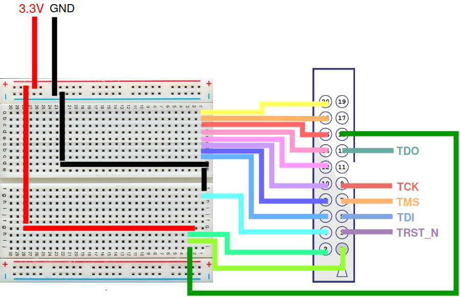
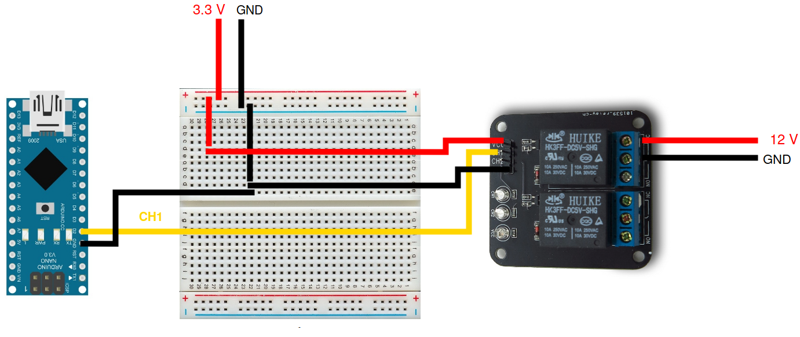

## Introduction
These instructions allow to automate the memory dump process of a STA8090FGBD chip using a JtagKey2, solving the problem of a periodic error condition of the device which prevent the dump to be executed all at once, by performing a hard reset.

## Circuit schematic

To perform a hard reset we need to switch on and off the power supply. We used a relay [HK3FF-DC5V-SHG](https://datasheet.lcsc.com/szlcsc/HK3FF-DC5V-SHG_C27840.pdf), which behaves as an electrically driven switch, exploiting the magnetic field generated by the flow of current in a coil of wire.  This model is able to output at most `30 VDC`, which makes it suitable for out `12 V` power supply.  
Since the circuit should be closed by default, the `NC` (Normally Closed) and `COM` pins of the relay have been connected in series to the `12 V` supply wires of the OCTO board.  
The relay is powered with the same `3.3 V` source as the JTAGkey2 and has the same common ground.  
The switch signal is connected to the Digital pin 2 of the Arduino Nano.  
The JtagKey2 is connected to the Jtag port as in the following picture:
  

The relay and the Arduino are connected in the following manner to the power supply:
  


## Configuration file
[Octo.cfg](../jtag/script/Octo.cfg) is the `OpenOCD` configuration file for the ST chip, which prints some log information on a file (octo_log.txt).   
Whenever the JTAG crashes or terminates correctly a 10 MB dump, a string is printed on the log file (respectively either "I'M DEAD" or "Everything is fine") followed by the next command to be launched to continue the dump (`dump_arm address size`).  
Moreover the command `shutdown` is invoked to close the `OpenOCD` session, and consequently also the Telnet connection.

## Python script
The heart of the procedure is the python script [reset_proc.py](../jtag/script/reset_proc.py). The whole dump procedure can be performed by setting up the circuit as previously explained and launching the following commands in a folder containing `jtagkey2.cfg`, `Octo.cfg`, `reset_proc.py`:
```
export openocd_dir=path-to-openocd
touch octo_log.txt
mkdir data
python reset_proc.py
```
The script is able by itself to open a shell running OpenOCD` -f jtagkey2.cgf -f Octo.cfg`, a Telnet connection to send commands to the JTAG and a serial connection to the Arduino Nano.  
Then, it starts monitoring the log file. As soon as it detects an error, it closes the shell and sends a character through the serial connection (`"g"`).
After that, it waits for an acknowledge from Arduino and opens again the shell for `OpenOCD` and the Telnet connection, launching the `dump_arm` command with the parameters saved in the log file.  
At the end, the `data` folder will contain all the dumps in different files of 10 kB each.  


## Arduino
Arduino Nano simply drives the relay when needed as in [python_talk.ino](../jtag/script/python_talk.ino) file.  
It checks the serial port and, whenever it receives the character `"g"` drives `HIGH` the Digital pin 2. The relay behaves as an open switch cutting off the power supply of the board. Then, it waits 2 seconds, drives the pin `LOW` again and sends and acknowledge character to python (`"k"`).

## Issues
The python script deals also with two main issues we encountered while dumping the memory:
1. from time to time `OpenOCD` crashes for unknown reasons without printing anything on the log file. This would cause the script to get stuck in an infinite loop while waiting for more instructions from OpenOCD. Therefore, we implemented a sort of "watchdog" timer which reset everything if the script has been stuck for too long.

2. some portions of the memory were impossible to dump and `OpenOCD` keeps throwing errors and trying to dump the same portion over and over again. To bypass this issue the script checks the address which is being dumped and if it is the same for more than 3 attempts it skips it and goes to the following 10Kb. Of course this procedure would be very slow and not applicable for large portions of memory.
